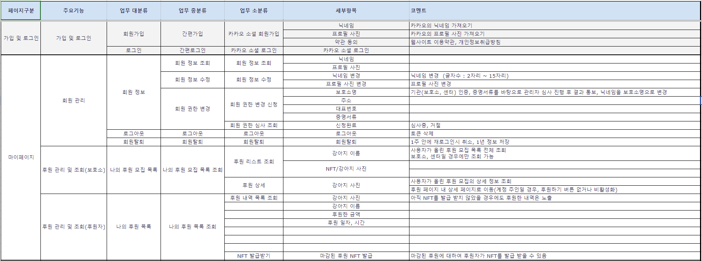
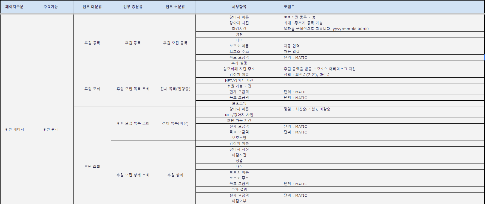
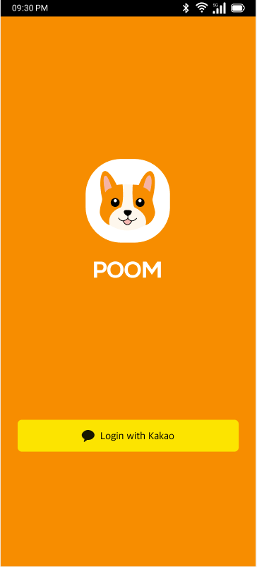
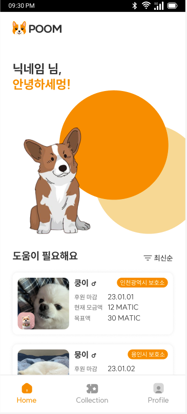
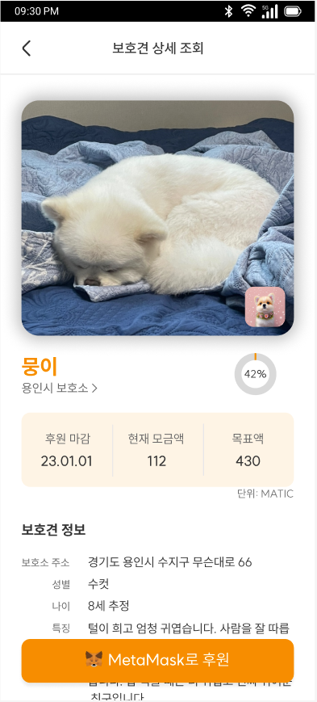
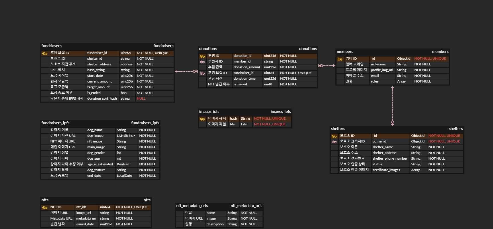
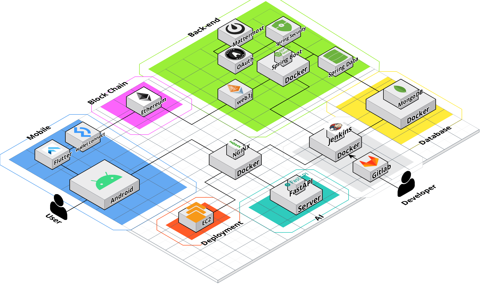

# POOM - 유기견 후원 및 NFT 발급 서비스

## 📅 프로젝트 기간

2023년 04월 10일 월요일 - 2023년 05월 19일 금요일 (총 기간 : 6주)

## 🌟 프로젝트 개요

1. **Summary(프로젝트 소개 및 요약)**

   - POOM은 보호소에서 관리받고 있는 유기견의 이미지를 NFT로 생성하여 후원하는 서비스 입니다.
   - 유기견을 입양하거나 보호단체에 직접 후원하는 것이 부담스러운 사람들도 간편하게 기부를 할 수 있습니다.
   - NFT를 활용하여 후원자들에게 독특하고 소중한 경험을 제공합니다.

2. **Planning Background(프로젝트 기획 배경)**

   - 유기견 보호 단체는 매년 많은 유기동물을 구조하고 돌보는 과정에 자금 부족에 시달리고 있다.
   - 이러한 자금 부족을 해결하기 위한 방안을 기존 후원 방식 외에도 NFT를 활용한 새로운 방식으로 후원 활동을 촉진하고자 합니다.
   - 중개 역할의 부재로 불투명한 후원을 해결하고자 기획했습니다.

3. **Problem(기존 시스템의 문제점)**

   - 보호소나 단체를 대신하여 후원금을 전달하는 중개 역할이 부재할 경우 적절하게 사용되지 않을 수 있다.
   - 또한, 후원자들에게 유기견과의 직접적인 상호작용의 기회를 제공하지 않아 만족도를 낮추고 장기적인 관심과 지속적인 기부를 유도하는데 어려움이 있다.
   - 후원의 형태와 방식에 제한을 가지고 있어 일부 사람들에게 접근성이 낮을 수 있다.

4. **Performance(시스템 성과 및 기대효과)**
   - 유기견 보호 단체들은 NFT를 판매하여 추가적인 자금을 모금할 수 있으며, NFT 가치가 상승함에 따라 긍정적 이익을 얻을 수 있습니다.
   - NFT를 활용한 후원은 블록체인 기술을 기반으로 하여 투명성과 신뢰성을 보장할 수 있습니다.
   - 자신이 기부한 기부금이 목적에 부합하는지 쉽게 확인할 수 있으며, 기부금이 안전하게 보호된다.

## ✨ 프로젝트 핵심 기능

1. **강아지 이미지 카툰화**
   - 강아지 구별 AI 학습 모델을 기반으로 강아지 이미지인지 판별한다.
   - 판별이 완료된 이미지를 기반으로 AI를 활용하여 카툰 이미지를 생성
2. **투명한 거래**
   - 블록체인을 활용을 통해 후원 내역을 관리하고 후원과정을 모두에게 제공함으로 투명성과 신뢰성을 보장할 수 있습니다.
3. **NFT 발급**
   - 개인 계정으로 후원한 내역을 통합적으로 확인할 수 있습니다.
   - 해당 강아지에 대한 후원 종료 후 금액 순위에 맞게 넘버링된 NFT를 발급해준다.
   - 본인이 구매한 NFT를 한 눈에 보기 쉽게 조회할 수 있습니다.

## 🧑🏻‍💻 팀 구성

- 백엔드
  - 정진수 - 팀장, AI 모델 생성, 모델 활용한 이미지 Detection, AI 홈 서버 구축
  - 두소원 - API 설계 및 개발, 블록체인 후원, 이미지 기반 NFT 생성
  - 이재욱 - API 설계 및 개발, CI/CD, 스마트 컨트랙트 작성 및 배포
  - 강태선 - AI를 활용한 이미지 카툰화, AI 전용 서버 배포  
- 프론트엔드
  - 송현주 - 대시보드 및 인트로 개발, 반응형 UI 구현, 디자인 설계
  - 안태현 - 개인 페이지 개발, 반응형 UI 구현, 디자인 설계, 로그인 구현

## 🔨 주요 기술

**Backend - Spring**

- IntelliJ IDE
- Java 11.0.14
- Springboot 2.7.11
- Spring Data JPA 2.7.11
- Spring Security 2.7.11
- Spring Validation 2.7.11
- Spring Web 2.7.7
- Spring Cloud 2.2.1
- Swagger2 3.0.0
- ipfs 1.3.3
- jackson 2.14.2
- jjwt 0.11.5
- gson 2.8.9

**Smart Contract**

- web3j 4.9.8
- walletconnect_dart 0.0.11
- truffle 4.6.17
- ganache 2.7.0

**CI/CD**

- AWS EC2
- Jenkins
- NGINX
- SSL

**Frontend**

- Visual Studio Code IDE
- Flutter 3.10.0-5.0.pre.24
- Dart 3.1.0
- dio 4.0.6
- shared_preferences 2.1.0
- http 0.13.5
- url_launcher 6.1.10
- image_picker 0.8.7+4
- kpostal 0.5.1
- cached_network_image 3.2.3
- shimmer 2.0.0
- social_share 2.3.1
- path_provider 2.0.14
- path 1.8.3
- cupertino_icons 1.0.2
- kakao_flutter_sdk_user 1.4.2
- intl 0.18.1
- flutter_dotenv 5.0.2
- flutter_secure_storage 8.0.0
- logger 1.3.0
- carousel_slider 4.2.1
- kakaomap_webview 0.6.2

## 📝 요구사항정의서

## 💄 디자인 시안

 

## 🔒 ERD

## 📄 아키텍처 구성도

## ⚙️ 프로젝트 파일 구조

**Backend**
  <pre>
  src 
    ├─ api 
    │    ├─ controller 
    │    ├─ service 
    │    │    ├─ {name}Service 
    │    │    └─ {name}ServiceImpl
    │    └─ dto
    │        └─ {name}
    │          ├─ request
    │          ├─ response
    │          └─ {SimpleDto1}
    ├─ config
    ├─ db
    │    ├─ entity
    │    ├─ repository
    │    └─ enum
    ├─ exception
    └─ util
  </pre>  

**Frontend**
<pre>
.
├─.dart_tool
├─.idea
├─android
├─assets
│  ├─config
│  ├─gifs
│  ├─icons
│  └─images
├─build
├─fonts
├─ios
├─lib
│  ├─models
│  │  ├─home
│  │  └─profile
│  ├─screens
│  ├─services
│  ├─utils
│  └─widgets
│      ├─collection
│      ├─home
│      ├─loading
│      ├─profile
│      ├─regist
│      └─shelter
├─linux
├─macos
├─test
├─web
└─windows
</pre>
## 🗣 협업 환경

- Jira
  - 프로젝트 스프린트를 정하고 한 주의 계획대로 프로젝트를 진행했습니다.
  - 팀원마다 주간 40의 Story Point를 설정하였습니다.
- Notion
  - 데일리 회의 스크럼, 요구 사항 정의서, API 명세서등을 문서화했습니다.
  - 코딩 컨벤션, 깃 컨벤션 등 팀원간 개발 규칙을 정의했습니다.
- Github
  - 코딩 컨벤션을 준수하며 프로젝트를 진행하였습니다.
  - Pull Request를 요청하고 팀원들과 코드리뷰를 진행하였습니다.
- Figma
  - 웹 페이지의 디자인 와이어프레임, 시안을 제작하였습니다.
  - 서비스 프로토타입을 제작하였습니다.

## 💪🏻 성장한 점

- 블록체인 기술 이해도 향상
  - 블록체인의 작동 방식, 특징, 장단점 등에 대해 학습하고 이해하는 시간이었습니다.
  - Solidity와 같은 계약 지향 프로그래밍 언어를 다루어 볼 수 있는 시간이었습니다.
- AI 기술 이해도 향상
  - AI 모델 학습을 위한 Tensorflow 라이브러리에 대해 학습하고 이해하는 시간이었습니다.
  - AI 모델을 애플리케이션에 적용하기 위한 Flask와 Python 언어를 다룰 수 있는 시간이었습니다.
  - 서로의 역할을 이해하고 존중 및 수용하는 과정을 배울 수 있었습니다.
- Mobile기반 Flutter 이해도 향상
  - Flutter프레임워크에 대해 학습하고 Mobile기반에서의 API 연동에 대해 배울 수 있는 시간이었습니다.
  - Flutter라는 새로운 프레임워크와 dart언어를 습득할 수 있었습니다. 특히, Flutter의 핫 리로드 기능을 통해 좀 더 빠르고 효율적으로 애플리케이션을 개발해볼 수 있었습니다. 이외에도 iOS와 Android를 비롯한 다양한 플랫폼 개발을 도전해볼 수 있었습니다.

## 🙏🏻 아쉬운 점(개선하고 싶은 점)

- AI 학습 모델 정확도 개선
  - 더 많은 이미지를 수집하여 학습 시킨 뒤 모델의 정확도를 더 높일 수 있습니다.
  - 정확도를 높인 모델 기반으로 이미지 구별을 더 명확하게 할 수 있습니다.
- 이미지 카툰화 개선
  - 강아지 이미지에 대한 카툰화를 이미지와 더 유사하게 생성할 수 있습니다.

## POOM 서비스 화면

> TODO
